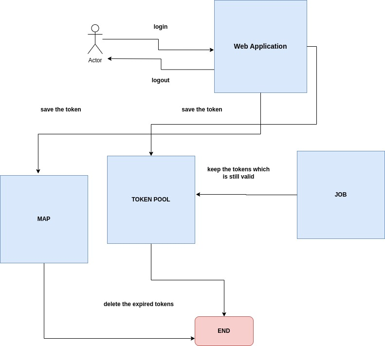

# Token Management System

## Overview
This project is a **Token Management System** implemented in Golang. It utilizes a **priority queue** to manage user session tokens with an expiration mechanism. The system provides APIs for user login, token retrieval, and logout, ensuring efficient handling of token expiry using a **heap-based approach**.

## Features
- **Token Queue**: Uses a priority queue (heap) to store tokens based on expiry.
- **Concurrency Safe**: Implements `sync.RWMutex` to handle concurrent access.
- **REST API**: Built with Echo for handling HTTP requests.
- **Periodic Expiry Check**: Uses `time.Ticker` to remove expired tokens.
- **Logging**: Integrated logging for better monitoring.

## Diagram

